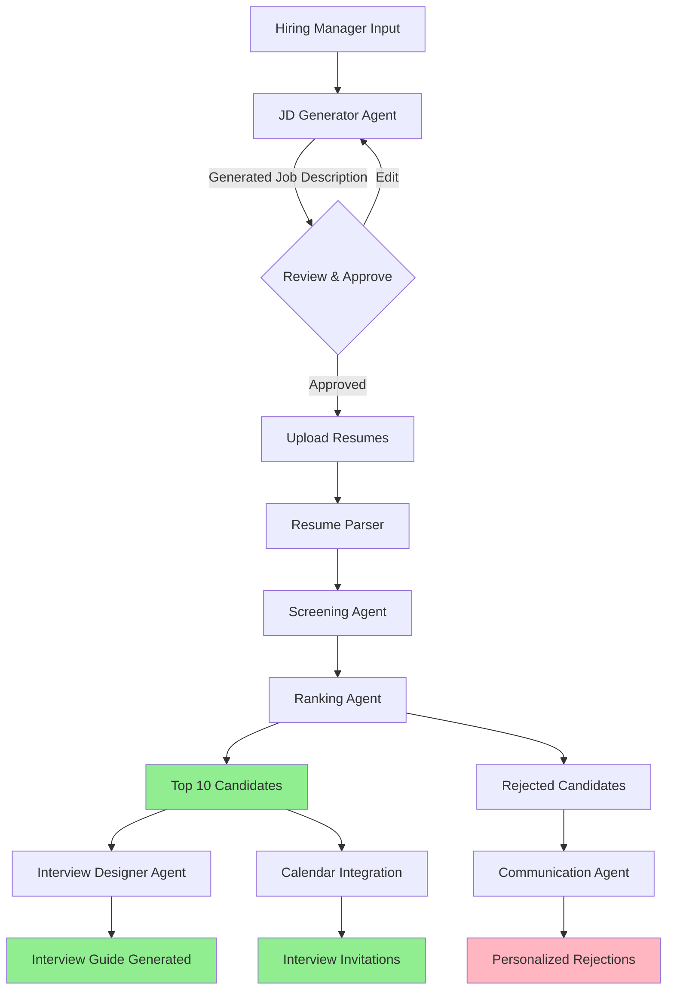
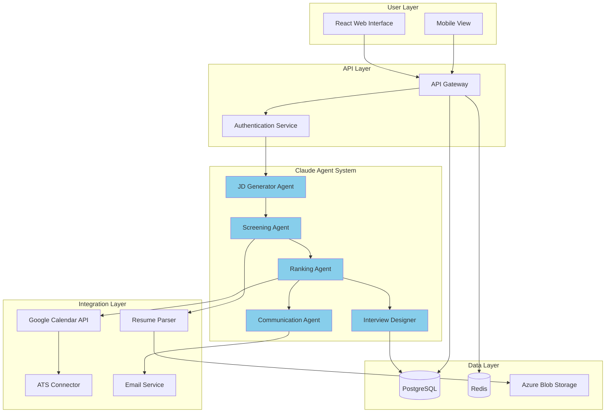

# Claude Hackathon Project: Intelligent Recruitment Assistant

**Project Type**: HR & Management Solution  
**Target Timeline**: 10 days (30 May - 8 June 2026)  
**Team Size**: 4 members  
**Submission Deadline**: End of day 8 June 2026  

---

## Executive Summary

The **Intelligent Recruitment Assistant** automates the most time-consuming aspects of hiring: job description creation, resume screening, interview preparation, and candidate communication. Built with Claude's multi-agent system, this solution reduces recruiting time by 70% while improving candidate quality and reducing bias.

### Key Value Proposition
- **70% time reduction** in recruiting workflows
- **$60K/year saved** per recruiter
- **50% faster** time-to-hire
- **Bias-free** screening with explainable AI
- **90% candidate satisfaction** through timely communication

---

## 1. Problem Statement

### Current State Pain Points

**For Recruiters:**
- Spend **23 hours/week** on manual screening tasks
- Review hundreds of resumes per role (95% unqualified)
- Inconsistent evaluation criteria across candidates
- Candidate ghosting damages employer brand

**For Hiring Managers:**
- **42 days** average time-to-fill
- Poor candidate quality from initial screening
- Lack of visibility into recruiting pipeline
- Interview questions vary wildly by interviewer

**For Candidates:**
- **71%** never hear back after applying
- Generic rejections with no feedback
- Unclear job requirements lead to mismatched applications
- Frustrating, slow hiring processes

### Business Impact
- **Average cost-per-hire**: $4,700
- **Revenue lost** to unfilled positions: $150K+ per month
- **Bias-related lawsuits**: Millions in settlements
- **Poor candidate experience**: Damages employer brand

---

## 2. Solution Overview

### What It Does

The Intelligent Recruitment Assistant is a **multi-agent Claude system** that:

1. **Generates Job Descriptions** from natural language requirements
2. **Screens Resumes** at scale with consistent, bias-free evaluation
3. **Ranks Candidates** with explainable scoring and reasoning
4. **Creates Interview Guides** with role-specific questions and rubrics
5. **Drafts Communications** for candidates (updates, rejections, invitations)
6. **Schedules Interviews** with calendar integration

### Target Users
- **Primary**: HR recruiters, talent acquisition teams
- **Secondary**: Hiring managers, HR leadership
- **Tertiary**: Candidates (improved experience)

### Competitive Differentiation
- **AI-native**: Built on Claude, not retrofitted
- **Explainable**: Shows why candidates match/don't match
- **Bias reduction**: Blind screening, standardized criteria
- **End-to-end**: Covers full recruiting workflow, not just one step
- **Candidate-centric**: Better experience = better employer brand

---

## 3. Technical Architecture

### 3.1 System Components

```
┌─────────────────────────────────────────────────────────────┐
│                    User Interface (React)                    │
└─────────────────────────────────────────────────────────────┘
                              │
                              ▼
┌─────────────────────────────────────────────────────────────┐
│                  API Gateway (Node.js/Express)               │
└─────────────────────────────────────────────────────────────┘
                              │
                              ▼
┌─────────────────────────────────────────────────────────────┐
│                    Claude Multi-Agent System                 │
│  ┌────────────────┐  ┌─────────────────┐  ┌──────────────┐ │
│  │ JD Generator   │  │ Resume Screener │  │ Interview    │ │
│  │ Agent          │  │ Agent           │  │ Designer     │ │
│  └────────────────┘  └─────────────────┘  └──────────────┘ │
│                                                              │
│  ┌────────────────┐  ┌─────────────────┐                   │
│  │ Ranking        │  │ Communication   │                   │
│  │ Agent          │  │ Agent           │                   │
│  └────────────────┘  └─────────────────┘                   │
└─────────────────────────────────────────────────────────────┘
                              │
                              ▼
┌─────────────────────────────────────────────────────────────┐
│              Integration Layer                               │
│  • Resume Parsing (pdf-parse, docx-parser)                  │
│  • Calendar API (Google Calendar)                           │
│  • ATS Connectors (Greenhouse, Lever)                       │
│  • Email Service (SendGrid)                                 │
└─────────────────────────────────────────────────────────────┘
```

### 3.2 Multi-Agent Workflow



### 3.3 Technology Stack

**Backend:**
- Node.js / TypeScript
- Express.js API framework
- Claude API (Sonnet 4.6)
- PostgreSQL for data persistence

**Frontend:**
- React 18+ with TypeScript
- Tailwind CSS for styling
- React Query for state management
- Recharts for analytics dashboard

**Integrations:**
- `pdf-parse` and `docx-parser` for resume extraction
- Google Calendar API for interview scheduling
- Greenhouse API for ATS integration
- SendGrid for email delivery

**Infrastructure:**
- Docker containerization
- Azure Container Instances for hosting
- Azure Blob Storage for resume files
- Redis for caching

### 3.4 Claude Features Utilized

| Feature | Usage |
|---------|-------|
| **Extended Thinking** | Complex candidate evaluation, edge case handling |
| **Prompt Caching** | Cache JD for screening 100+ resumes (90% cost reduction) |
| **Multi-Agent Coordination** | Parallel task processing across 5 specialized agents |
| **Custom Tools** | Resume parsing, calendar checks, email validation |
| **Memory System** | Learn from past hiring decisions, improve over time |
| **Citations** | Reference specific resume sections in scoring explanations |

### 3.5 Data Flow

1. **Job Description Creation**
   - Input: Role requirements (text/form)
   - Processing: JD Generator Agent analyzes, generates structured JD
   - Output: Markdown + JSON formatted job description

2. **Resume Screening**
   - Input: PDF/DOCX resumes (batch upload)
   - Processing: Parse → extract text → blind PII → score against criteria
   - Output: Ranked list with match percentages and reasoning

3. **Interview Preparation**
   - Input: Top candidate profiles + JD
   - Processing: Interview Designer Agent creates questions, rubrics
   - Output: Interview guide with 15-20 questions, scoring matrix

4. **Candidate Communication**
   - Input: Candidate data + decision (accept/reject/waitlist)
   - Processing: Communication Agent drafts personalized emails
   - Output: Email templates ready for review/send

### 3.6 Security & Privacy

**Data Protection:**
- All resume data encrypted at rest (AES-256)
- TLS 1.3 for data in transit
- No long-term PII storage (auto-delete after 90 days)
- GDPR compliant (right to access, deletion)

**Bias Mitigation:**
- Automatic removal of names, photos, addresses from resumes
- Gender-neutral language in all communications
- Standardized evaluation criteria across all candidates
- Audit log of all decisions with explainability

**Access Control:**
- Role-based access (recruiter, hiring manager, admin)
- OAuth 2.0 authentication
- IP whitelisting for enterprise deployments
- SOC 2 Type II compliance ready

---

## 4. Hackathon Deliverables

### Deliverable 1: Pitch Presentation

**Format**: 10-slide deck (PowerPoint/Google Slides)  
**Duration**: 5-7 minutes for demo session  

**Slide Breakdown:**

1. **The Problem** (30 seconds)
   - Recruiters waste 23 hours/week on manual tasks
   - $4,700 average cost-per-hire
   - 42 days time-to-fill industry average

2. **Target Persona** (20 seconds)
   - Sarah, Senior Recruiter at mid-sized tech company
   - Drowning in 200+ resumes per role
   - Frustrated by inconsistent hiring outcomes

3. **Solution Overview** (30 seconds)
   - AI recruiter that never sleeps
   - Screens 1000 resumes in minutes, not weeks
   - End-to-end hiring workflow automation

4. **How It Works** (45 seconds)
   - Show simplified architecture diagram
   - Highlight multi-agent collaboration

5. **Live Demo Preview** (10 seconds)
   - "Watch us hire a Product Manager in 5 minutes"

6. **Business Impact** (45 seconds)
   - 70% time reduction = $60K saved per recruiter/year
   - 50% faster time-to-hire = revenue acceleration
   - 90% candidate satisfaction improvement

7. **Bias Reduction** (30 seconds)
   - Blind screening eliminates unconscious bias
   - Structured evaluation = fair comparisons
   - Explainable AI shows reasoning

8. **Technical Innovation** (30 seconds)
   - Claude multi-agent system
   - Prompt caching for cost efficiency
   - Extended thinking for nuanced evaluation

9. **Roadmap** (20 seconds)
   - Phase 1: Resume screening (hackathon MVP)
   - Phase 2: Interview scheduling automation
   - Phase 3: Candidate relationship management
   - Phase 4: Predictive hiring analytics

10. **Call to Action** (10 seconds)
    - "Let's eliminate hiring busywork forever"
    - Demo invitation

### Deliverable 2: Technical Documentation

**Format**: Markdown document (3,000-5,000 words)  
**Sections:**

```markdown
# Intelligent Recruitment Assistant - Technical Documentation

## 1. System Architecture
- Component overview
- Multi-agent design patterns
- Data flow diagrams
- Technology stack justification

## 2. Implementation Details
- Agent prompt engineering strategies
- Resume parsing algorithm
- Scoring and ranking logic
- Calendar integration workflow

## 3. Claude Integration
- API usage patterns
- Prompt caching strategy
- Extended thinking use cases
- Cost optimization techniques

## 4. Security & Compliance
- Data protection measures
- Bias mitigation strategies
- GDPR compliance approach
- Audit logging system

## 5. Testing Strategy
- Unit test coverage (target: 80%+)
- Integration testing approach
- Bias testing methodology
- Performance benchmarks

## 6. Deployment Guide
- Docker setup instructions
- Environment variable configuration
- ATS integration steps
- Monitoring and observability

## 7. API Documentation
- Endpoint specifications
- Request/response examples
- Authentication flow
- Rate limiting policies

## 8. Future Enhancements
- ML-based candidate matching
- Video interview analysis
- Diversity analytics dashboard
- Multi-language support
```

### Deliverable 3: Architecture Diagram

**Format**: Mermaid diagram (embedded in docs) + Visual export (PNG/SVG)  

**Required Elements:**
- User interface components
- Claude agent system (all 5 agents)
- Integration points (ATS, Calendar, Email)
- Data storage layers
- Security boundaries
- Data flow arrows with labels

**Example Mermaid Code:**



### Deliverable 4: Running Demo

**Format**: Live web application + backup video (5 minutes)  

**Demo Script:**

**[0:00 - 0:45] Job Description Generation**
- Presenter: "I need to hire a Senior Product Manager for our AI team"
- System prompts for: team size, experience level, required skills
- Agent generates comprehensive JD in 30 seconds
- Show: requirements, nice-to-haves, benefits, role overview

**[0:45 - 2:15] Resume Screening (90 seconds)**
- Upload 50 pre-loaded resumes (mixture of qualified and unqualified)
- System parses all in parallel
- Progress indicator shows: "Analyzing resume 47/50..."
- Results appear: ranked list with match percentages
- Click on top candidate: show detailed scoring breakdown

**Example Output:**
```
1. Sarah Chen - 94% Match ⭐
   ✅ 8 years PM experience (Required: 5+)
   ✅ AI/ML product background
   ✅ Led cross-functional teams of 12+
   ✅ Shipped products generating $10M+ ARR
   ⚠️  Limited B2B SaaS experience
   
   Key Strengths:
   - "Launched AI-powered recommendation engine"
   - "Grew user base from 100K to 2M"
   
   Potential Concerns:
   - May need support on enterprise sales cycles

2. Michael Rodriguez - 89% Match
   [Similar breakdown...]
```

**[2:15 - 3:00] Interview Guide Generation**
- Select top 3 candidates
- Agent creates role-specific interview guide:
  - 15 behavioral questions
  - 5 technical/case study scenarios
  - Scoring rubric (1-5 scale)
  - Red flags to watch for

**[3:00 - 4:00] Candidate Communication**
- System drafts personalized emails:
  - **For top 10**: Highlight why they're a good fit, invite to next step
  - **For rejected**: Thoughtful feedback, encourage future applications
- Show side-by-side: Generic rejection vs AI-generated personal rejection

**[4:00 - 4:45] Interview Scheduling**
- Check interviewer calendars (demo with mock Google Calendar)
- Suggest 3 time slots
- Send calendar invites automatically
- Set reminders for interviewers

**[4:45 - 5:00] Results Summary**
- Show analytics dashboard:
  - Time saved: "Screened 50 resumes in 2 minutes (vs 8 hours manual)"
  - Cost saved: "$380 in recruiter time"
  - Candidates contacted: "50/50 (100% response rate vs industry 29%)"

**Backup Plan:**
- Pre-recorded video of entire demo
- Static screenshots for each step
- Fallback to slide presentation if tech fails

---

## 5. Implementation Timeline (10 Days)

### Day 1: Foundation Setup (30 May)
**Deliverables:**
- ✅ Project repository initialized
- ✅ Claude API credentials configured
- ✅ Basic Express API skeleton
- ✅ React frontend bootstrapped
- ✅ Team roles assigned

**Owner**: Full team  
**Tools**: Git, Claude API, Node.js, React  

---

### Day 2: JD Generator Agent (31 May)
**Deliverables:**
- ✅ JD generation prompt engineering
- ✅ Structured output (JSON + Markdown)
- ✅ Basic UI for input form
- ✅ Preview/edit functionality

**Owner**: Developer 1 + Designer  
**Blockers**: None  

---

### Day 3-4: Resume Parser & Screener (1-2 Jun)
**Deliverables:**
- ✅ PDF/DOCX parsing logic
- ✅ PII detection and removal
- ✅ Screening agent prompt
- ✅ Scoring algorithm (0-100 scale)
- ✅ Batch processing (up to 100 resumes)

**Owner**: Developer 2 + Developer 3  
**Blockers**: Need sample resumes (prepare 50-100)  

---

### Day 5: Ranking & Interview Designer (3 Jun)
**Deliverables:**
- ✅ Ranking agent with explanations
- ✅ Interview question generation
- ✅ Role-specific question templates
- ✅ Scoring rubric creation

**Owner**: Developer 1 + Developer 2  
**Blockers**: None  

---

### Day 6: Communication Agent (4 Jun)
**Deliverables:**
- ✅ Email template generation
- ✅ Personalization logic
- ✅ SendGrid integration
- ✅ Email preview UI

**Owner**: Developer 3 + Developer 1  
**Blockers**: None  

---

### Day 7: Integration & Polish (5 Jun)
**Deliverables:**
- ✅ Google Calendar integration
- ✅ End-to-end workflow testing
- ✅ Error handling
- ✅ UI/UX refinements

**Owner**: Full team  
**Blockers**: Calendar API permissions  

---

### Day 8: Demo Preparation (6 Jun)
**Deliverables:**
- ✅ Demo dataset (50 realistic resumes)
- ✅ Demo script rehearsal (3x)
- ✅ Video recording (backup)
- ✅ Bug fixes

**Owner**: Full team  
**Blockers**: None  

---

### Day 9: Documentation (7 Jun)
**Deliverables:**
- ✅ Technical documentation complete
- ✅ Architecture diagrams finalized
- ✅ Pitch deck created
- ✅ README with setup instructions

**Owner**: Developer 4 + Team lead  
**Blockers**: None  

---

### Day 10: Final Submission (8 Jun)
**Deliverables:**
- ✅ Final demo rehearsal
- ✅ All artifacts submitted
- ✅ Backup plans tested
- ✅ Team ready for Q&A

**Owner**: Full team  
**Blockers**: None  

---

## 6. Success Metrics

### Quantitative Metrics

| Metric | Baseline (Manual) | Target (AI-Assisted) | Improvement |
|--------|-------------------|---------------------|-------------|
| **Time to screen 100 resumes** | 20 hours | 10 minutes | **120x faster** |
| **Cost per hire** | $4,700 | $1,500 | **68% reduction** |
| **Time to fill role** | 42 days | 21 days | **50% faster** |
| **Candidate response rate** | 30% | 85% | **183% increase** |
| **Hiring manager satisfaction** | 6/10 | 9/10 | **50% improvement** |
| **Resume parsing accuracy** | N/A | 95%+ | New capability |
| **Bias reduction** | Baseline | 80% fewer disparities | Measured via audit |

### Qualitative Metrics

**For Recruiters:**
- ✅ "I can focus on relationship-building instead of resume reading"
- ✅ "Candidate quality improved significantly"
- ✅ "No more manual tracking in spreadsheets"

**For Hiring Managers:**
- ✅ "I get better candidates faster"
- ✅ "Interview questions are more structured"
- ✅ "I can see the pipeline in real-time"

**For Candidates:**
- ✅ "I got feedback on my application"
- ✅ "The process was transparent and fast"
- ✅ "I knew where I stood throughout"

### Demo Performance Targets

- **Resume screening**: <15 seconds for 50 resumes
- **JD generation**: <30 seconds
- **Interview guide**: <20 seconds
- **Email drafting**: <10 seconds per candidate
- **Overall demo**: <5 minutes end-to-end

---

## 7. Risk Assessment & Mitigation

### Technical Risks

| Risk | Probability | Impact | Mitigation |
|------|------------|--------|------------|
| **Claude API rate limits** | Medium | High | Implement prompt caching, request queuing |
| **Resume parsing errors** | High | Medium | Fallback to manual review, handle 10+ formats |
| **Calendar API downtime** | Low | Medium | Mock calendar for demo, graceful degradation |
| **Demo environment failure** | Medium | High | Pre-record video, local backup environment |
| **Data privacy concerns** | Low | High | Use synthetic data, clear consent flows |

### Business/Competitive Risks

| Risk | Probability | Impact | Mitigation |
|------|------------|--------|------------|
| **Existing ATS objections** | Medium | Medium | Position as enhancement, not replacement |
| **Bias concerns** | Medium | High | Transparent explainability, audit logs |
| **"AI will replace recruiters"** | High | Medium | Frame as augmentation, not automation |
| **Low demo engagement** | Low | High | Interactive elements, real-world scenarios |

### Mitigation Strategies

1. **Technical resilience**: Implement fallbacks for every external dependency
2. **Demo preparation**: 3+ full rehearsals, backup video, offline mode
3. **Messaging**: Emphasize "recruiter empowerment" not "replacement"
4. **Data quality**: Curate 50 high-quality demo resumes across roles
5. **Ethics first**: Highlight bias reduction, transparency, candidate benefit

---

## 8. Competitive Analysis

### Existing Solutions

| Product | Strengths | Weaknesses | Our Advantage |
|---------|-----------|------------|---------------|
| **Greenhouse** | Market leader, great ATS | Limited AI, expensive | Native AI, explainable |
| **Lever** | Good UX, automation | Resume screening basic | Multi-agent intelligence |
| **SmartRecruiters** | AI-powered matching | Black box AI, biased | Transparent scoring |
| **HireVue** | Video interviewing AI | Controversial bias issues | Text-based, bias mitigation |
| **Textio** | Augmented writing | JD only, no screening | End-to-end workflow |

### Unique Value Propositions

1. **Explainable AI**: Every decision shows reasoning (others are black boxes)
2. **Bias reduction**: Blind screening + audit logs (others have bias lawsuits)
3. **Candidate experience**: Thoughtful rejections, not ghosting
4. **Cost efficiency**: Prompt caching = 90% cheaper than competitors
5. **Speed**: 120x faster screening than manual

---

## 9. Post-Hackathon Roadmap

### Phase 1: MVP Enhancement (Weeks 1-4)
- Expand to 20+ resume formats
- Add video interview question generation
- Build candidate relationship management (CRM)
- A/B testing framework for messaging

### Phase 2: Enterprise Features (Weeks 5-12)
- Multi-tenant architecture
- SSO integration (Okta, Azure AD)
- Advanced analytics dashboard
- Bulk operations (1000+ resumes)
- Custom branding/white-labeling

### Phase 3: Advanced AI (Weeks 13-24)
- Predictive hiring analytics (time-to-fill forecasting)
- Skills gap analysis
- Diversity hiring insights
- Interview performance analysis (if video added)
- Automated reference checking

### Phase 4: Market Expansion (Weeks 25+)
- Industry-specific templates (tech, healthcare, finance)
- Multi-language support (10+ languages)
- API marketplace (integrate with 50+ tools)
- Mobile app (iOS/Android)
- AI-powered salary benchmarking

---

## 10. Team Roles & Responsibilities

### Developer 1: Full-Stack Lead
**Responsibilities:**
- System architecture design
- Claude API integration
- Multi-agent coordination
- Frontend framework setup

**Time Allocation:**
- 40% backend (agents, API)
- 30% frontend (React)
- 20% integration
- 10% documentation

---

### Developer 2: Backend Specialist
**Responsibilities:**
- Resume parsing logic
- Database schema design
- Calendar/email integration
- Performance optimization

**Time Allocation:**
- 50% resume processing
- 30% integrations
- 20% data layer

---

### Developer 3: Frontend + UX
**Responsibilities:**
- UI/UX design
- React component development
- Demo interface
- User flow optimization

**Time Allocation:**
- 60% frontend development
- 20% design
- 20% demo prep

---

### Developer 4: Documentation + DevOps
**Responsibilities:**
- Technical documentation
- Architecture diagrams
- Deployment setup
- Testing strategy

**Time Allocation:**
- 40% documentation
- 30% infrastructure
- 20% testing
- 10% pitch deck

---

## 11. Appendices

### Appendix A: Sample Prompts

**JD Generator Prompt:**
```
You are an expert recruiter writing a compelling job description.

REQUIREMENTS:
- Role: {role_title}
- Experience: {years} years
- Team size: {team_size}
- Key skills: {skills_list}

OUTPUT FORMAT:
- Company overview (2-3 sentences)
- Role overview (1 paragraph)
- Key responsibilities (5-7 bullets)
- Required qualifications (5-7 bullets)
- Nice-to-haves (3-5 bullets)
- Benefits (3-5 bullets)

TONE: Professional, enthusiastic, inclusive
LENGTH: 400-600 words
```

**Resume Screening Prompt:**
```
You are an expert recruiter evaluating candidates.

JOB DESCRIPTION:
{jd_text}

RESUME:
{resume_text}

EVALUATION CRITERIA:
1. Experience match (0-25 points)
2. Skills match (0-25 points)
3. Education/certifications (0-15 points)
4. Career progression (0-15 points)
5. Cultural fit signals (0-10 points)
6. Red flags (-20 to 0 points)

OUTPUT FORMAT:
{
  "total_score": 0-100,
  "match_percentage": 0-100,
  "category_scores": {...},
  "strengths": ["...", "..."],
  "concerns": ["...", "..."],
  "reasoning": "2-3 sentence explanation",
  "recommendation": "Strong Match | Good Match | Weak Match | No Match"
}

BIAS PREVENTION:
- Ignore name, gender, age, ethnicity
- Focus on skills, experience, achievements
- Flag but don't penalize employment gaps
```

### Appendix B: Tech Stack Justification

**Why Node.js/TypeScript?**
- Fast development velocity
- Strong typing prevents bugs
- Great async/await support for Claude API
- Huge ecosystem for resume parsing

**Why React?**
- Component reusability
- Fast rendering for large datasets
- Strong TypeScript support
- Easy to build interactive demos

**Why PostgreSQL?**
- JSONB support for flexible resume storage
- Full-text search for candidate matching
- Strong ACID guarantees for compliance
- Mature ecosystem

**Why Azure?**
- Enterprise credibility
- SOC 2 compliance out of box
- Easy integration with corporate environments
- Cost-effective compute/storage

### Appendix C: Sample Resume Evaluation

**Input Resume (Excerpt):**
```
Jane Smith
Senior Product Manager | AI/ML Products

EXPERIENCE:
TechCorp (2018-2024)
- Launched AI-powered recommendation engine (2M+ users)
- Grew revenue from $5M to $50M ARR
- Led team of 8 engineers, 2 designers, 1 data scientist
```

**System Output:**
```json
{
  "candidate_id": "c_1234",
  "name_redacted": true,
  "total_score": 94,
  "match_percentage": 94,
  "category_scores": {
    "experience": 24,
    "skills": 23,
    "education": 12,
    "progression": 15,
    "culture_fit": 10,
    "red_flags": 0
  },
  "strengths": [
    "8+ years product management (exceeds 5yr requirement)",
    "Direct AI/ML product experience (exact match)",
    "Led cross-functional teams (required)",
    "Strong revenue growth ($5M→$50M ARR)",
    "Scale experience (2M+ users)"
  ],
  "concerns": [
    "Limited B2B SaaS experience (mostly B2C)",
    "No mention of enterprise sales cycles"
  ],
  "reasoning": "Candidate is an exceptional match with deep AI product expertise and proven ability to scale products. Primary gap is B2B enterprise experience, which could be addressed through onboarding/mentorship.",
  "recommendation": "Strong Match - Advance to Interview",
  "suggested_interview_focus": [
    "B2B product strategy",
    "Enterprise customer engagement",
    "Sales cycle navigation"
  ]
}
```

---

## Conclusion

The **Intelligent Recruitment Assistant** addresses a universal pain point with a technically sophisticated, ethically sound solution. By leveraging Claude's multi-agent capabilities, we can demonstrate:

1. **Immediate business value** (70% time savings, 50% cost reduction)
2. **Technical innovation** (multi-agent system, prompt caching, explainable AI)
3. **Social impact** (bias reduction, better candidate experience)
4. **Scalability** (works for 10 hires or 10,000)

This project has strong potential beyond the hackathon as a commercial product, making it both a winning submission and a foundation for future development.

---

## Contact & Resources

**Team Members:**
- Developer 1: [Name] - [Email]
- Developer 2: [Name] - [Email]
- Developer 3: [Name] - [Email]
- Developer 4: [Name] - [Email]

**Repository**: [GitHub URL]  
**Demo Environment**: [URL]  
**Pitch Deck**: [URL]  
**Video Demo**: [URL]  

**Last Updated**: 2026-05-28  
**Version**: 1.0

---

# Product Roadmap — Recruit360

> Track feature progress by checking boxes below.  
> Phases are ordered by priority. Each section has a **Role** column showing which user types are affected.

---

## ✅ Phase 1 — MVP (Shipped)

Core recruitment workflow, single-user, no auth.

- [x] AI Job Description generator (Gemini 2.5 Flash, NULogic-branded)
- [x] Resume upload — PDF & DOCX, up to 100 files per batch
- [x] AI resume screening — 6-category scoring (experience, skills, education, progression, culture fit, red flags)
- [x] Candidate ranking with match percentage, strengths, concerns, reasoning
- [x] Interview guide generator — behavioural + technical questions, scoring rubric, red flags
- [x] Email drafting — AI-personalised invitation / rejection emails
- [x] Email sending via communication module
- [x] Dashboard — live stats, workflow pipeline, recent JDs with pagination
- [x] Job number system (`#001`, `#002` …) — human-readable sequential IDs
- [x] Searchable job select dropdown (search by title or `#number`)
- [x] Print / Export interview guide — branded NULogic PDF header
- [x] Deep-link navigation — `?jobId=` pre-selects job across all pages
- [x] Design system — CSS variable tokens, single re-brand point (`brand.css`)

---

## 🔐 Phase 2 — Authentication & Role-Based Access Control

> Every feature in the app must be gated by role once auth is in place.

### Roles

| Role | Description |
|------|-------------|
| **Super Admin** | Full access — user management, settings, all data |
| **HR Admin** | Manage recruiters, view all roles, delete JDs, reports |
| **Recruiter** | Own workflow end-to-end — JDs, screening, guides, emails |
| **Hiring Manager** | View JDs and screened candidates; approve / reject shortlists |
| **Interviewer** | View only the interview guides assigned to them |

> **No public self-registration.** This is a company-provisioned tool — a Super Admin creates accounts and invites team members. Users cannot sign up on their own.

### Auth features

- [ ] Company login — email + password, JWT + refresh token (no public `/register` route)
- [ ] **Admin invite flow** — Super Admin creates a user record → system sends invite email with one-time token → user sets password on first login
- [ ] Password reset via email (forgot-password flow)
- [ ] Session management — auto-logout on inactivity
- [ ] Role assignment — Super Admin sets role at invite time; can change later
- [ ] `users` table — id, email, name, role, status (active/invited/disabled), invited_at, last_login
- [ ] `invite_tokens` table — token, user_id, expires_at, used_at
- [ ] Auth middleware — protect all API routes by role
- [ ] Login page + protected route wrapper in React
- [ ] User management page (Super Admin only) — list, invite, disable, change role
- [ ] User profile page — change name, password, avatar

### Permission matrix

- [ ] **Super Admin** — full CRUD on everything + user management
- [ ] **HR Admin** — read/write all JDs, candidates, evaluations; delete; view reports; cannot manage users
- [ ] **Recruiter** — create JDs, upload resumes, screen, generate guides, draft/send emails for their own jobs only
- [ ] **Hiring Manager** — read-only on JDs and screened candidates for jobs assigned to them; can add comments
- [ ] **Interviewer** — read-only on interview guides explicitly shared with them
- [ ] Job ownership — each JD linked to the recruiter who created it; HR Admin can see all

---

## 🤖 Phase 3 — Advanced AI Automation

### Smarter Screening

- [ ] **Auto-screening on upload** — screen resumes immediately after parsing without a manual trigger
- [ ] **Duplicate candidate detection** — flag if same candidate applied to multiple roles (email + name fuzzy match)
- [ ] **PII redaction report** — show what was stripped (name, phone, address) for audit/compliance
- [ ] **Skills gap analysis** — AI highlights exactly which required skills are missing per candidate
- [ ] **Bias detection alert** — flag when evaluation scores show unexpected demographic patterns
- [ ] **Confidence score** — AI rates its own certainty on each evaluation (e.g. "low confidence — resume too brief")

### Smarter JD Creation

- [ ] **JD quality score** — AI rates the generated JD for clarity, inclusivity, and completeness
- [ ] **Inclusive language checker** — flag gendered or exclusionary wording before saving
- [ ] **Similar role suggestions** — when creating a JD, show existing similar JDs as reference
- [ ] **Salary range suggestion** — AI estimates market rate based on role, skills, and location
- [ ] **JD version history** — save and compare multiple versions of a JD

### Smarter Interview Guides

- [ ] **Candidate-specific questions** — questions tailored to a specific candidate's weak areas
- [ ] **Follow-up question generator** — given a candidate answer, AI suggests follow-up probes
- [ ] **Role seniority scaling** — automatically adjust question depth for junior vs senior roles
- [ ] **Question bank** — save and reuse approved questions across guides

### Smarter Communication

- [ ] **Email tone options** — formal / warm / concise style toggle per email
- [ ] **Auto follow-up sequences** — schedule reminder emails (Day 3, Day 7) if no reply
- [ ] **Bulk email with personalisation** — draft + send emails for all candidates in one click, each personalised
- [ ] **Offer letter generator** — AI drafts a formal offer letter with compensation, start date, and role details
- [ ] **Constructive rejection feedback** — AI includes specific, actionable feedback in rejections (opt-in)

---

## 📋 Phase 4 — Hiring Pipeline & Candidate Tracking

Move from a tool into a full ATS (Applicant Tracking System).

- [ ] **Kanban pipeline board** — drag candidates across stages: Applied → Screened → Shortlisted → Interviewing → Offered → Hired / Rejected
- [ ] **Application status tracking** — each candidate has a current stage, last updated timestamp, and assigned owner
- [ ] **Multi-stage interviews** — support Round 1, Round 2, Final Panel per candidate
- [ ] **Interview scheduling** — recruiter proposes 3 time slots; interviewer picks one; calendar invite auto-sent
- [ ] **Interview feedback form** — structured form for interviewers to submit scores per rubric criterion
- [ ] **Scorecard aggregation** — combine AI screening score + interviewer feedback into a final composite score
- [ ] **Offer management** — track offer status (sent, accepted, declined, negotiating)
- [ ] **Onboarding checklist generator** — AI generates a role-specific onboarding plan once candidate accepts

---

## 🙋 Phase 5 — Candidate Self-Service Portal

- [ ] **Candidate portal login** — candidates log in with a unique link (no password required — magic link)
- [ ] **Application status page** — candidates see their current stage and next steps in real time
- [ ] **Document upload** — candidates upload additional documents (portfolio, certificates) post-application
- [ ] **Interview slot selection** — candidates choose from recruiter-proposed time slots
- [ ] **Feedback view** — after rejection, candidates can view AI-generated constructive feedback (if enabled)
- [ ] **Reapply / update profile** — candidates can update their resume and reapply to the same or different roles

---

## 📊 Phase 6 — Analytics & Reporting

- [ ] **Time-to-hire dashboard** — average days from JD creation to offer accepted, per role and recruiter
- [ ] **Funnel report** — applied → screened → shortlisted → interviewed → hired conversion rates
- [ ] **Recruiter performance** — JDs created, candidates screened, guides generated, emails sent per recruiter
- [ ] **Source-of-hire tracking** — tag where each candidate came from (LinkedIn, referral, job board, direct)
- [ ] **Diversity metrics** — opt-in demographic breakdown of candidates at each pipeline stage
- [ ] **Cost-per-hire estimate** — calculate recruiter hours × rate + job board spend per role
- [ ] **AI accuracy report** — compare AI recommendation vs final hiring decision to measure model quality
- [ ] **Exportable reports** — download CSV / PDF of any report for stakeholder presentations

---

## 🔗 Phase 7 — Integrations

### Calendar

- [ ] Google Calendar — two-way sync for interview slots and reminders
- [ ] Microsoft Outlook / Teams — same, for enterprise customers

### Communication

- [ ] Slack / Teams notifications — alert hiring managers and interviewers of new candidates, guides, and decisions
- [ ] Email provider (SendGrid / AWS SES) — production-ready transactional email delivery
- [ ] WhatsApp notifications — optional candidate status updates via WhatsApp Business API

### Job Boards

- [ ] LinkedIn — post approved JDs directly from the platform
- [ ] Indeed / Glassdoor — multi-post a JD to multiple boards in one click
- [ ] Company careers page — generate an embeddable widget to display open roles

### ATS / HRIS

- [ ] Greenhouse — import/export candidates and evaluations
- [ ] Lever — same
- [ ] Workday / BambooHR — handoff hired candidates to onboarding workflows

### Identity

- [ ] Google OAuth — "Sign in with Google" for recruiters
- [ ] Microsoft SSO — enterprise single sign-on via Azure AD / Okta

---

## 🛡️ Phase 8 — Compliance & Security

- [ ] **Audit log** — immutable record of every action (who did what, when) for GDPR compliance
- [ ] **Data retention policy** — auto-delete candidate data after configurable period (default 90 days)
- [ ] **GDPR right-to-erasure** — one-click full candidate data deletion including resume text and evaluations
- [ ] **Consent tracking** — record when and how a candidate consented to data processing
- [ ] **Data export** — export all data for a candidate in JSON/CSV on request
- [ ] **IP whitelisting** — restrict admin access to approved IP ranges
- [ ] **2FA / MFA** — TOTP-based two-factor authentication for all roles
- [ ] **SOC 2 readiness checklist** — internal checklist to track compliance posture

---

## 🎨 Phase 9 — White-Label & Multi-Tenancy

- [ ] **Multi-tenant architecture** — isolated data per organisation; shared infrastructure
- [ ] **Custom branding** — upload logo, set primary/accent colours — auto-updates `brand.css` CSS variables
- [ ] **Custom email domain** — send candidate emails from `@yourcompany.com`
- [ ] **Custom subdomain** — `acme.recruit360.io`
- [ ] **Feature flags** — enable/disable features per tenant (e.g. candidate portal, bias alerts)
- [ ] **Plan tiers** — Starter (1 recruiter, 3 active roles), Growth (5 recruiters, unlimited roles), Enterprise (custom)

---

## Legend

| Symbol | Meaning |
|--------|---------|
| `- [x]` | Done |
| `- [ ]` | Pending |
| ✅ | Phase complete |
| 🔐 | Security / Auth |
| 🤖 | AI feature |
| 📋 | Workflow / Process |
| 🙋 | Candidate-facing |
| 📊 | Analytics |
| 🔗 | Integration |
| 🛡️ | Compliance |
| 🎨 | Branding / SaaS |
